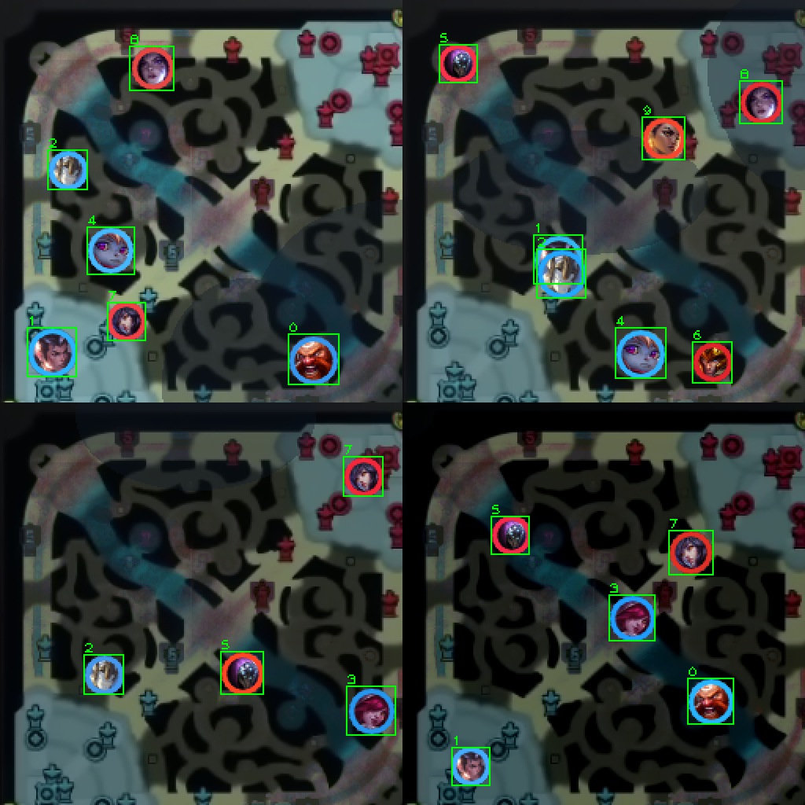
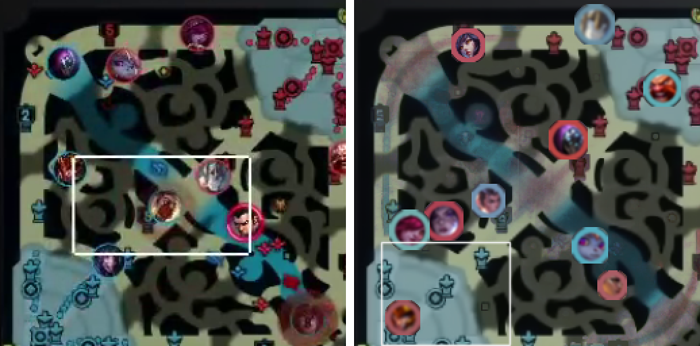
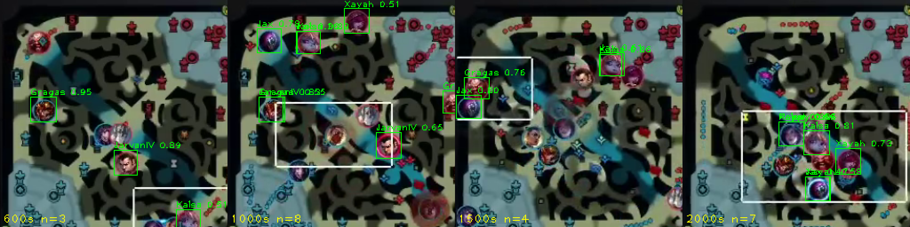
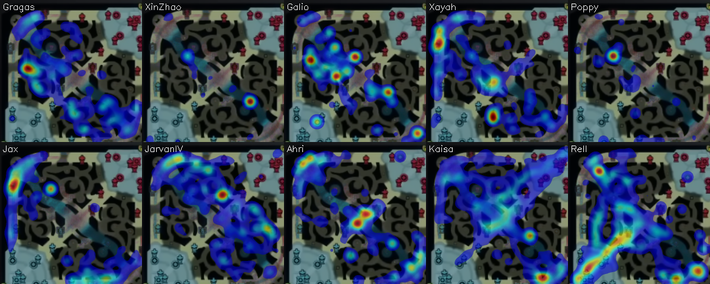
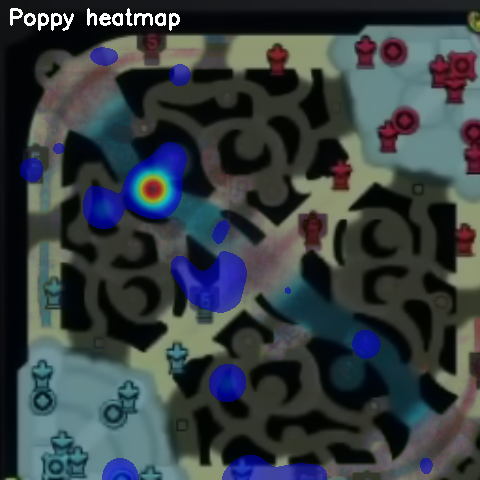
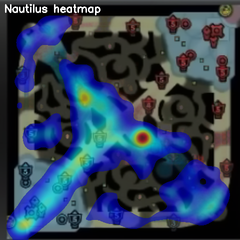
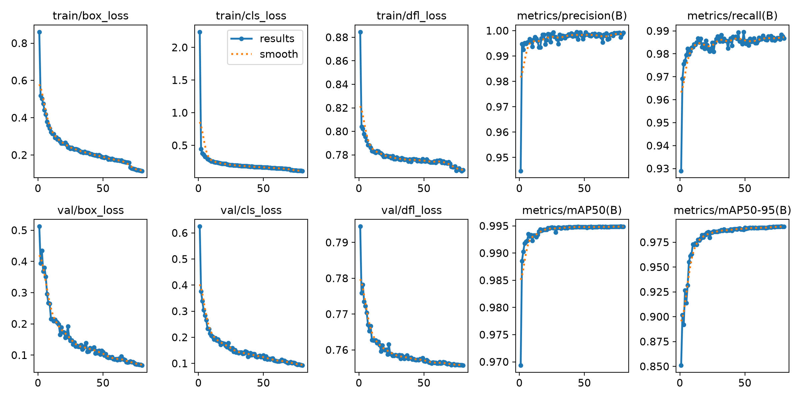

# LoL 小地圖英雄偵測與職業選手走位量化(YOLO11)

**免人工標註**:以「合成資料」訓練 YOLO11,從《英雄聯盟》職業比賽轉播的小地圖偵測 10 位英雄的即時位置,再據此計算走位量化指標,分析職業選手(T1 Keria)的操作。

- 分析素材:Worlds 2024 總決賽 Game 5(T1 vs BLG),追蹤目標 Keria(Poppy,輔助)
- 全片偵測 **67,790 筆**英雄座標(2 fps 取樣),合成驗證集 **mAP50 = 0.995 / mAP50-95 = 0.991**
- 指標設計參考 CHI'24 論文 *Characterizing and Quantifying Expert Input Behavior in League of Legends*(Lee et al., Yonsei)

## Pipeline

```
比賽 VOD ─→ 抽幀 ─→ 裁切小地圖 (1645,800)–(1890,1045) ─→ YOLO11 偵測
                                                            │
   合成訓練資料(免標註)──訓練──────────────────────────────┘
                                                            ▼
                                      (英雄, 隊伍, x, y, t) → positions.csv
                                                            │
                                              熱區圖 + 走位量化指標
```

## 核心方法:合成資料 + sim2real

比賽畫面沒有現成標註,手動標上萬張幀不現實。本專案**全程不做人工標註**:

1. **乾淨底圖**:對整場影片的小地圖做「中位數背景萃取」,自動去除英雄圖示/視野/技能特效,得到乾淨地圖底圖(`03_make_background.py`)
2. **英雄圖示**:從 Riot Data Dragon 抓 10 隻英雄頭像,程式化做成圓形遮罩 + 隊伍色環(T1 藍 / BLG 紅)(`04_fetch_icons.py`)
3. **合成訓練集**:隨機貼 3~10 隻英雄到底圖上(可重疊,模擬團戰),同步寫出 YOLO 標註;疊加亮度/色相抖動、戰爭迷霧、觀戰視野框、壓縮模糊等擾動(`05_gen_synthetic.py`)

**sim2real 教訓(本專案最關鍵的除錯)**:第一版合成圖太「乾淨」——圖示銳利、色環太細、沒有視野框——模型在合成驗證集近乎滿分,真實畫面卻幾乎抓不到。逐項對照真實幀改良:取樣真實畫面的環色、加粗色環、模擬影片壓縮模糊、讓臉部填滿圓形、加入白色視野框之後,模型直接泛化到真實轉播畫面。

| 合成訓練資料樣本 | 合成 vs 真實比較 |
|---|---|
|  |  |

**真實轉播幀偵測結果**(模型只看過合成資料):



## 成果

### 走位熱區圖(整場 10 隻英雄)



Keria(Poppy)單獨熱區:



### 量化指標(`10_skill_index.py`)

CHI'24 論文的 8 項指標來自滑鼠/鍵盤記錄;轉播影片只有位置資訊,因此:

- **Positioning(忠實對應)**:走位軌跡「轉向角」平均——連續移動向量的夾角,越大代表方向變化越多、越難預測(論文用連續右鍵向量,此處以位置向量對應)
- **位置原生延伸指標**:活動量(路徑長)、地圖覆蓋率(12×12 網格)、與我方 ADC 平均距離、游走比例
- **校準方式比照論文**:對同場 10 名選手計算相同指標後排名,觀察 Keria 的相對位置

### 延伸分析:跨場比較 Keria vs Career(EWC 2026)

同一條 pipeline 換一場比賽即可重跑:改 `config.yaml`(英雄名單、小地圖座標、隊伍)後從步驟 03 起重新執行。已用 **EWC 2026 八強 Game 1(DK vs BLG)** 分析 DK 輔助 **Career(Nautilus)**,與 Keria(Poppy)的同型開團坦輔助對照;兩場的對面輔助恰好都是 ON:

| 指標 | Keria(Poppy, Worlds 2024)| Career(Nautilus, EWC 2026)|
|---|---|---|
| 轉向角同場排名 | #10 / 10(32.9°) | #5 / 10(32.1°) |
| 地圖覆蓋率 | 73.6% | 66.7% |
| 與 ADC 平均距離 | 0.300 | 0.326 |
| 游走比例 | 59.6% | 66.3% |
| 對位輔助(ON)覆蓋率 | 69.4%(Rell) | 59.7%(Camille) |



這輪也做了**第二次 sim2real 迭代**:EWC 後期畫面的戰鬥煙霧、低對比與滿地圖守衛小點讓後期 recall 驟降,把「更暗的亮度範圍、更濃霧區、守衛雜訊點、放大圖示」加入合成資料重訓後,後期偵測從 0~2 隻回到 3~7 隻。注意跨場比較僅供參考(不同版本/英雄/對手),方法上嚴謹的是「同場 10 人排名」的校準;`positions.csv` 與 `models/minimap.pt` 目前對應 EWC 場次,Worlds 場次的結果封存於 `outputs/positions_keria_worlds2024.csv` 與 `config_keria_worlds2024.yaml`。

### 訓練(YOLO11s, 80 epochs, imgsz=256, RTX 4060)

| Precision | Recall | mAP50 | mAP50-95 |
|---|---|---|---|
| 0.999 | 0.987 | 0.995 | 0.991 |



## 快速開始

```powershell
python -m venv .venv
.\.venv\Scripts\Activate.ps1
# 先依 https://pytorch.org/get-started/locally/ 裝對應 CUDA 的 PyTorch
pip install -r requirements.txt

# 完整流程(要換別場比賽:改 config.yaml 的 champions 與 minimap 座標)
python scripts/01_download_vod.py "<YouTube 賽事 VOD 網址>"
python scripts/02_grab_frame.py            # 抽幀、確認小地圖座標
python scripts/03_make_background.py       # 中位數背景萃取
python scripts/04_fetch_icons.py           # 抓英雄頭像 (Data Dragon)
python scripts/05_gen_synthetic.py         # 合成 2000 train / 200 val
python scripts/06_train.py yolo11s.pt 80   # 訓練 → models/minimap.pt
python scripts/07_detect.py                # 全片偵測 → outputs/positions.csv
python scripts/08_check_real.py            # sim2real 抽查
python scripts/09_analyze.py               # 熱區圖 + 基本指標
python scripts/10_skill_index.py           # CHI'24 式量化指標與排名
```

已附上訓練好的權重 `models/minimap.pt` 與整場偵測結果 `outputs/positions.csv`,可直接跑 `09`/`10` 的分析。

## 專案結構

```
lol-minimap-yolo/
├─ config.yaml            # 比賽設定:英雄名單、小地圖座標、Data Dragon 版本
├─ scripts/01~10_*.py     # 依編號執行的完整 pipeline
├─ models/minimap.pt      # 訓練好的 YOLO11s 權重
├─ outputs/positions.csv  # 整場偵測結果 (frame, time, champion, team, conf, x, y)
├─ docs/                  # README 用的成果圖
└─ data/                  # VOD / 幀 / 合成資料集(由腳本產生,不入版控)
```

## 技術棧

Python · PyTorch (CUDA) · Ultralytics YOLO11 · OpenCV · NumPy · yt-dlp

## 參考資料

- Lee et al., *Characterizing and Quantifying Expert Input Behavior in League of Legends*, CHI 2024(指標定義與標定方式;[資料集](https://github.com/narey54541/LLL))
- [DeepLeague](https://github.com/farzaa/DeepLeague) — 小地圖偵測先行研究
- [LeagueAI](https://github.com/Oleffa/LeagueAI) — 合成訓練資料的參考實作
- 靈感來源:YouTube 影片《硬核分析 Keria 的天賦有多高》

## 聲明

本專案為個人研究/學習用途。英雄頭像來自 Riot Data Dragon;賽事畫面截圖僅作方法示意,版權屬原轉播方,請勿散布抽取的完整畫面。League of Legends © Riot Games — 本專案與 Riot Games 無關。
