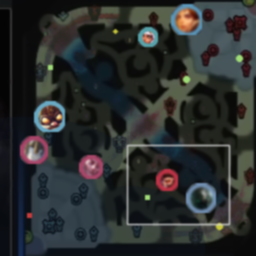
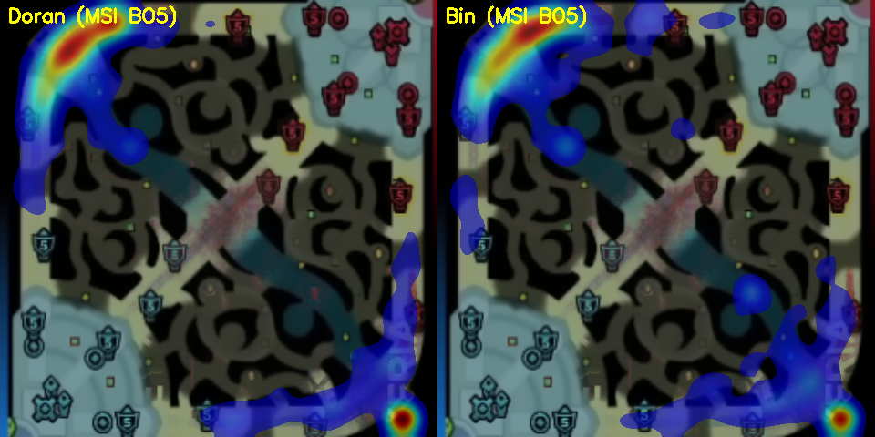
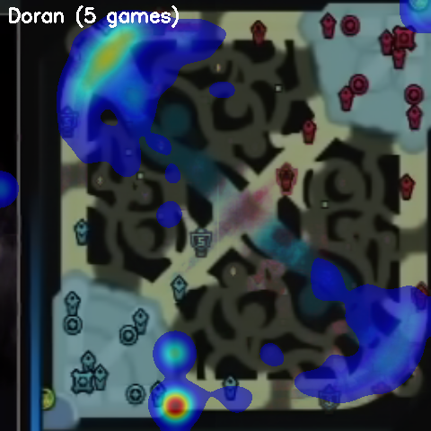
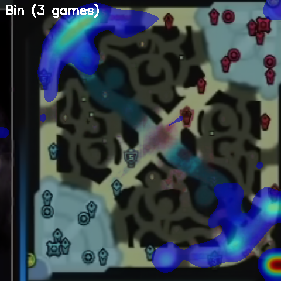

# LoL 小地圖偵測與職業上路選手操作量化(YOLO11)

> **發想出處**:YouTube 頻道**圓某人和四某人**的影片[《硬核分析Keria的天賦有多高》](https://www.youtube.com/watch?v=wQOFX4SB6Go)用模型量化了輔助選手 Keria 的操作。我把同一套想法應用到最吃個人操作上限的上路,分析兩位頂尖上路 Doran(T1)與 Bin(BLG)。指標定義對齊該影片同樣引用的 CHI'24 延世大學論文;pipeline 與程式為獨立實作。

- 免人工標註:程式合成訓練資料訓練 YOLO11,合成驗證集 mAP50 ≈ 0.99,泛化到真實轉播畫面
- 已分析 **13 場**職業比賽(Worlds 2025 決賽 BO5、瑞士輪 R5,MSI 2026 八強 BO5),共 **282,530 筆**座標

| 合成訓練資料 | 真實轉播幀偵測(模型只看過合成資料)|
|---|---|
|  |  |

**sim2real 迭代紀錄**:(1) 首版合成太乾淨,真實畫面幾乎抓不到 → 取樣真實環色、加粗色環、壓縮模糊後泛化成功;(2) 後期戰鬥煙霧與守衛雜訊使 recall 驟降 → 加入暗亮度、濃霧、雜訊點重訓解決;(3) 58 類聯集模型在真實畫面混淆嚴重 → 改為每場獨立 10 類模型。

## 指標定義(位置版,對齊 CHI'24 論文精神)

- **走位轉向角**:連續移動向量的夾角平均,越高=方向變化越多、越難預測
- **地圖覆蓋率**:12×12 網格中走過的格子比例
- **路徑長/分**:連續取樣段的平均移動速度(不受偵測率差異影響)
- **校準**:每場對同場 10 名選手算同一指標後排名,再對系列做樣本加權彙總

## 成果:Doran vs Bin

### MSI 2026 八強:完整 BO5 同場對決(最公平的比較)

兩人同一系列、每場同時在場、對手與節奏完全相同(T1 vs BLG,2026-07-04,BLG 3-2 T1)。每場先算各自的同場 10 人排名:

| 場次 | Doran | 轉向角(排名)| 覆蓋率 | Bin | 轉向角(排名)| 覆蓋率 |
|---|---|---|---|---|---|---|
| G1(T1 勝)| Yorick | 13.8°(#7)| 74.3% | Jayce | 15.1°(#6)| 79.2% |
| G2(BLG 勝)| Ambessa | 10.4°(#8)| 46.5% | Renekton | 11.6°(#7)| 56.9% |
| G3(BLG 勝)| Zaahen | 41.7°(#1)| 56.2% | Jax | 24.2°(#3)| 67.4% |
| G4(T1 勝)| K'Sante | 18.1°(#5)| 69.4% | Gwen | 14.4°(#7)| 55.6% |
| G5(BLG 勝)| Gnar | 7.1°(#10)| 56.2% | Rumble | 10.7°(#8)| 59.0% |
| **BO5 加權** | | **15.1°(均#6.0)** | **62.4%** | | **14.8°(均#5.8)** | **64.3%** |

兩人走位轉向角幾乎打平、同場排名接近,Bin 覆蓋率與移動速度略高(路徑長/分 2.21 vs 1.71),與 BLG 3-2 贏下系列一致。

MSI BO5 兩人走位疊加熱區(左 Doran / 右 Bin):



### Worlds 2025 各自的最終系列賽(參考)

Doran 冠軍戰(T1 3-2 KT,奪冠)、Bin 淘汰戰(TES 2-1 BLG,出局)。因對手與英雄池不同,僅供參考:

| | Doran(5 場)| Bin(3 場)|
|---|---|---|
| 走位轉向角(加權)| 21.7° | 11.8° |
| 地圖覆蓋率(加權)| 70.6% | 55.4% |
| 路徑長/分(加權)| 2.33 | 1.47 |

| Doran 系列疊加熱區 | Bin 系列疊加熱區 |
|---|---|
|  |  |

> 位置指標量的是「這場比賽中的走位輸出」,受英雄選擇影響大,不等於選手絕對實力;同場排名才是校準過的比較。

## 快速開始

```powershell
python -m venv .venv ; .\.venv\Scripts\Activate.ps1
# 先依 https://pytorch.org/get-started/locally/ 裝對應 CUDA 的 PyTorch
pip install -r requirements.txt

# 單場流程(config.yaml 已設為 Worlds 2025 決賽 G5)
python scripts/01_download_vod.py "<VOD 網址>"
python scripts/02_grab_frame.py      # 抽幀、校正小地圖座標
python scripts/03_make_background.py # 中位數背景萃取
python scripts/04_fetch_icons.py     # 抓英雄頭像
python scripts/05_gen_synthetic.py   # 合成訓練資料
python scripts/06_train.py yolo11s.pt 80
python scripts/07_detect.py          # → outputs/positions.csv
python scripts/09_analyze.py         # 熱區圖
python scripts/10_skill_index.py     # 同場排名與對位比較

# 多場批次(場次設定在 games/*.yaml)
bash scripts/run_all_games.sh        # 逐場 合成→訓練→偵測(可中斷續跑)
python scripts/11_bo5_compare.py     # 系列彙總:Doran vs Bin
```

已附上 13 場的偵測結果(`outputs/positions_*.csv`)與示範模型 `models/minimap.pt`,可直接跑 `09`/`10`/`11` 分析。

## 專案結構

```
lol-minimap-yolo/
├─ config.yaml               # 單場示範設定
├─ games/*.yaml              # 13 場的場次設定(Worlds 2025 ×8、MSI 2026 ×5)
├─ scripts/01~11 + run_all_games.sh
├─ models/minimap.pt         # 示範權重(各場權重由批次腳本重建)
├─ outputs/positions_*.csv   # 13 場偵測結果
└─ docs/                     # README 成果圖
```

## 技術棧

Python · PyTorch (CUDA) · Ultralytics YOLO11 · OpenCV · NumPy · yt-dlp

## 參考資料

- 發想出處:圓某人和四某人,[《硬核分析Keria的天賦有多高》](https://www.youtube.com/watch?v=wQOFX4SB6Go)(題目與思路來源;程式為獨立實作)
- Lee et al., *Characterizing and Quantifying Expert Input Behavior in League of Legends*, CHI 2024(指標定義)
- [DeepLeague](https://github.com/farzaa/DeepLeague)、[LeagueAI](https://github.com/Oleffa/LeagueAI) — 先行研究
- 比賽數據:[gol.gg](https://gol.gg/);畫面來源:Worlds 2025 與 MSI 2026 賽事 VOD(僅供個人研究)

## 聲明

本專案為個人研究/學習用途。英雄頭像來自 Riot Data Dragon;賽事畫面截圖僅作方法示意,版權屬原轉播方。League of Legends © Riot Games — 本專案與 Riot Games 無關。
